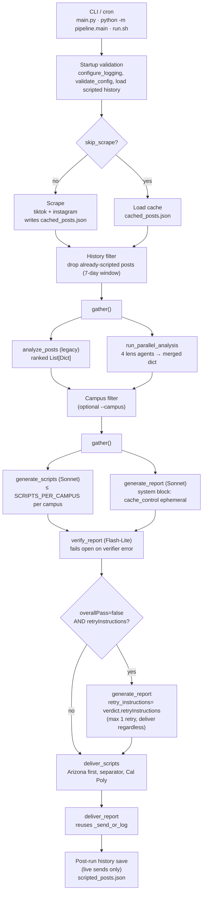

# Architecture — Unigliss Trend Radar

## Two-Tier AI Hierarchy

The pipeline uses two AI tiers to balance cost and quality:

**Tier 1 — Gemini Flash-Lite (free)**
- Legacy ranker: batches 5 posts per call, returns virality score, trend classification, audio lifecycle, and campus relevance for script-generator input.
- Four parallel lens agents (`pipeline/agents.py` + `skills/*.md`): engagement, trends, competitors, content classification. Each agent hits the same posts batch once per run and returns its own JSON-shaped dict for the report writer.
- Report verifier (`pipeline/report_verifier.py`): one call per cycle against the Sonnet report; fails open on any verifier-side error so a flaky verifier never blocks delivery.
- Budget guardrail: `MAX_GEMINI_CALLS_PER_RUN=500`.

**Tier 2 — Claude Sonnet (paid)**
- Script generator (`pipeline/script_generator.py`): up to 3 briefs per campus, drawing the ranked top-N from the legacy analyzer + campus context from `knowledge_base.py`.
- Insight report writer (`pipeline/report_writer.py`): one cross-campus markdown brief per run, consumes the merged four-lens dict. The Anthropic system block carries `cache_control: {"type": "ephemeral"}` so the skill prompt is served from the prompt cache between runs.
- Up to 8 Anthropic calls per run under current caps (6 scripts + 1 report + 1 optional retry when the verifier flags a regeneration).

**Why two tiers?** Gemini is free but less creative. Sonnet is excellent at tone and format but costs money. Gemini filters up to 130 posts into ranked candidates and fans them out across four lens agents that feed Sonnet both the script and the insight report.

## Operational Hardening

- Scraper-level dedup persists seen posts to `data/seen_posts.json`.
- Delivered-script history persists to `data/scripted_posts.json`, is checked before analyzer runs, and expires entries older than 7 days.
- Startup logging is dual-path: console plus rotating file logging at `data/logs/pipeline.log`.
- Gemini, Anthropic, and Telegram use shared retry logic with exponential backoff and no retries on `401`.
- `run.sh` activates the repo venv and captures stdout/stderr to `data/logs/cron.log` for cron-safe execution.

## Data Flow

`pipeline/main.py::run_pipeline_async` is the orchestrator. Stages that fan out run under `asyncio.gather`; sync stages are dispatched through `asyncio.to_thread` so the legacy module-level patches in `tests/test_main.py` keep intercepting.



### Agent → skill → output contract

Every new multi-agent tier — the four lens agents, the report writer, and the verifier — loads its system prompt from a flat markdown file under `skills/` via `pipeline/skills.py::load_skill`. The legacy analyzer and script generator pre-date the skills layer and keep their prompts in `pipeline/knowledge_base.py` (the script generator is campus-parameterized, which the current skill loader does not template). Lens agents fail to a safe-default shape on any error so a partial Gemini outage never breaks the run; the verifier fails open for the same reason.

| Agent | Module | Skill file | Output contract | Safe-default shape |
|---|---|---|---|---|
| Legacy analyzer | `pipeline/analyzer_legacy.py` | (prompt in module) | Ranked `List[Dict]` feeding script generator | `[]` |
| Engagement analyzer | `pipeline/agents.py::run_engagement_analyzer` | `skills/engagement-analysis.md` | dict at key `engagement` | `{topPerformers:[], engagementPatterns:{}}` |
| Trend detector | `pipeline/agents.py::run_trend_detector` | `skills/trend-detection.md` | dict at key `trends` | `{emergingTrends:[], fadingTrends:[]}` |
| Competitor analyzer | `pipeline/agents.py::run_competitor_analyzer` | `skills/competitor-analysis.md` | dict at key `competitors` | `{competitorInsights:[], gapOpportunities:[]}` |
| Content classifier | `pipeline/agents.py::run_content_classifier` | `skills/content-classification.md` | dict at key `contentThemes` | `{contentThemes:[], performanceByTheme:{}}` |
| Script generator | `pipeline/script_generator.py` | (campus-parameterized prompt in `knowledge_base.py`) | `List[Dict]` of briefs | `[]` |
| Report writer | `pipeline/report_writer.py` | `skills/report-writer.md` | markdown string | `_FALLBACK_REPORT` |
| Report verifier | `pipeline/report_verifier.py` | `skills/report-verification.md` | `{overallPass, rules, retryInstructions}` | fail-open `{True, [], None}` |

## Knowledge Architecture

The runtime pipeline processes content. The knowledge architecture processes learning around that runtime so the project compounds operational memory instead of re-deriving it every session.

```
CLAUDE.md
  -> PRIMER.md
  -> SKILL_REVIEWER.md
  -> SELF_OPTIMIZATION.md
  -> obsidian-vault/
  -> CLAUDE.md
```

### Stage 1 — `CLAUDE.md`

- Permanent operating rules for the repo: commands, conventions, durable gotchas, and hard constraints.
- This is the highest-signal startup file for future coding sessions.

### Stage 2 — `PRIMER.md`

- Session-start briefing only: current sprint, blockers, recent changes, current numbers, and the human's session goal.
- This file is intentionally overwritten as the working context changes.

### Stage 3 — `SKILL_REVIEWER.md`

- Step-by-step playbooks for recurring work such as adding a campus, debugging a failed run, tuning prompts, or deploying to the Pi.
- Every playbook points back to real modules, functions, and test files in this repo.

### Stage 4 — `SELF_OPTIMIZATION.md`

- Append-only log for prompt changes, script-review observations, reliability patterns, and decisions made.
- This is where experimental findings accumulate before they are promoted into more durable documentation or code.

### Stage 5 — `obsidian-vault/`

- Long-term note graph for daily runs, trends, scripts, campuses, audio, dashboards, and strategic canvases.
- The vault is versioned with the repo, but the pipeline does not write into it automatically yet.

### Stage 6 — Compound Loop

- Durable findings move upward in stability:
  `SELF_OPTIMIZATION.md` -> `SKILL_REVIEWER.md` -> `CLAUDE.md`
- Trend or campus insights confirmed repeatedly can also promote into `pipeline/knowledge_base.py`.
- This keeps short-term learning from dying in chat history while preventing `CLAUDE.md` from filling with one-off observations.

## Campus Configuration

Campus configuration lives in `pipeline/knowledge_base.py` → `CAMPUS_REGISTRY`. Adding a new campus requires:

1. Add a new entry to `CAMPUS_REGISTRY` with `display_name`, `emoji`, `hashtags`, and `context`
2. The `SUPPORTED_CAMPUSES` tuple and scraper hashtag seeds derive automatically from that registry
3. Review any campus-specific tests or mock content for new local references

This data should be reviewed and updated regularly. The more specific and current the campus context, the better the scripts.

## Cron Schedule

Two daily runs, timed for peak posting windows across both campus timezones:

- **12:00 PM MST** — catches morning trends, scripts ready for afternoon posting
- **7:00 PM MST** — catches afternoon trends, scripts ready for evening posting

Arizona (MST) and Cal Poly (PST) are 1 hour apart, so both windows work well for both campuses.

## Usage Ceilings

| Component | Calls/Run | Runs/Day | Daily Calls | Source |
|-----------|-----------|----------|-------------|--------|
| Gemini Flash-Lite | 31 max | 2 | 62 max | 26 legacy analyzer + 4 lens agents + 1 verifier |
| Claude Sonnet 4 | 8 max | 2 | 16 max | 6 scripts (`SCRIPTS_PER_CAMPUS=3` × 2 campuses) + 1 report + 1 retry |
| RapidAPI/Scraptik | 20 max | 2 | 40 max | 10 scraper requests/platform/run, 2 platforms |

Legacy analyzer breakdown: `SCRAPE_LIMIT=20`, 2 platforms, 9 hashtags/platform, batch size 5 → 26 calls worst case. Lens agents each fire once per run against the shared posts batch. The verifier fires once per report cycle; the retry fires at most once when `overallPass=false AND retryInstructions` is non-empty.

Pricing is intentionally not hard-coded here because vendor pricing changes independently of the repo. The codebase fixes the usage ceilings above; actual spend depends on the current Gemini, Anthropic, and Scraptik pricing active at runtime.

## What's NOT in v1

- **Pinterest scraping** — planned for future, not prioritized
- **Standalone audio tracker** — audio lifecycle is tagged by Gemini, not tracked independently
- **Automated Obsidian vault output** — the vault exists, but runtime note generation is still manual
- **Local LLM (Ollama/Qwen)** — replaced by cloud API approach for reliability
- **Two-node Pi+Mac architecture** — consolidated to single Pi 5
- **Multiple Telegram channels** — single private channel, owner forwards manually
